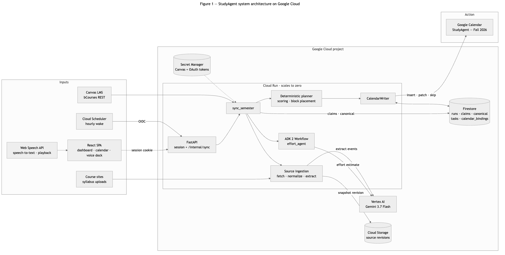
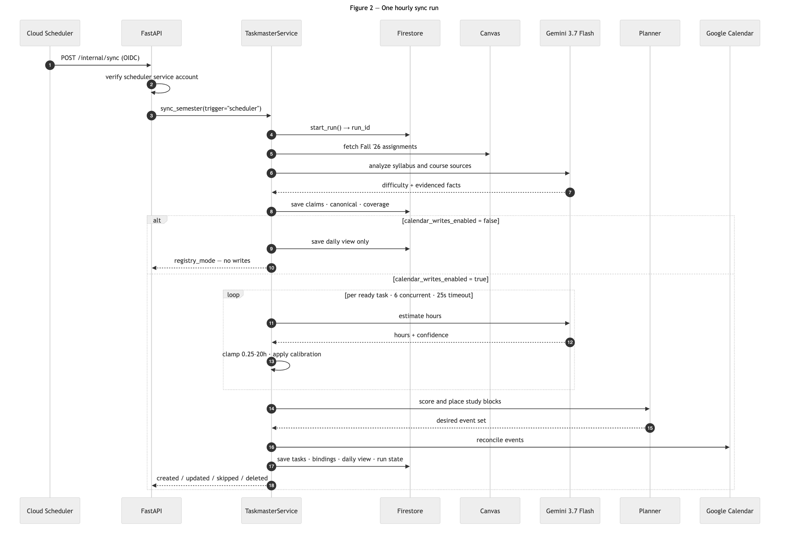
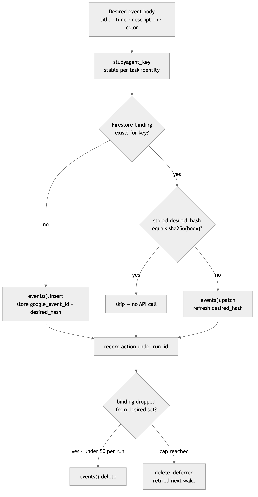

# StudyAgent

An agent that finds your coursework wherever it lives, works out what's urgent,
and puts it on your calendar autonomously before you fall behind.

Built for the All Things Agentic hackathon (Taskmaster track) using the Google
Agent Development Kit 2, Gemini 3.7 Flash on Vertex AI, and Google Cloud Run.

---

## The problem

What we realised was that students don't miss deadlines because they're careless. They miss them because
the work isn't all in one place.

A single semester's assignments are spread across bCourses, a syllabus PDF, a
course website, Gradescope, and Ed announcements. Nothing reconciles those, so
staying on top of your own coursework means checking five places and holding the
rest in your head. The first time you find out about a deadline is often after
you've missed it.

We ran into this ourselves in our everyday lives, but we wanted to be sure it wasn't just us before
building anything. It isn't. It's structural, and it affects any student whose
courses don't all live in the same system.


## What existing tools miss

There are already plenty of tools that connect to Canvas. That part isn’t really the problem.

The problem is that Canvas is only one of the places where your work lives. And even when a tool pulls everything from Canvas, you usually just end up with another list of assignments.

**Your work is scattered everywhere.**

In one of our classes, Canvas only showed two assignments. The syllabus had seven, including both midterms and all of the research project deadlines. The midterm that actually inspired this project was buried three pages into a PDF in a paragraph about grading.

Other classes are even more spread out. Homework might be on Gradescope, announcements on Ed, deadlines on a course website, and almost nothing on Canvas.

StudyAgent pulls from bCourses, syllabus PDFs, and course websites and puts everything in one place. So if a professor never adds a midterm to Canvas, it can still find it.

**But having everything in one place still doesn’t tell you what to do.**

Knowing you have nine things due is useful, but it doesn’t answer the question you actually care about as to what should I work on today?

It also doesn’t know that you TA a class and need time to grade, or that you care more about a high-value project than a smaller assignment due sooner.

StudyAgent asks how you want to prioritize your work, then turns those deadlines into actual blocks on your calendar all autonomously.

Instead of opening a to-do list and figuring out your day yourself, you can just open your calendar and see the plan.

**Your schedule also changes all the time.**

Professors move deadlines sometimes. New assignments get added. Projects show up halfway through the semester.

A plan that looked right at the start of the week can be wrong a few days later.

StudyAgent keeps checking your course sources and updates your calendar when things change, so you don’t have to keep maintaining it yourself.

**And none of that matters if you don’t trust it.**

This was one of the biggest things we kept coming back to.

If a tool invents an assignment or gets a deadline wrong once, you stop trusting it. At that point, it’s easier to just manage everything yourself.

So StudyAgent won’t schedule something unless it can trace it back to an actual line in an actual source.

The goal isn’t just to collect your assignments. It’s to build a plan you can actually rely on.


## What students told us

We surveyed 64 Berkeley students to better understand the problem and see whether it generalized across a larger group. All 64 said they would use a tool like this. Forty said definitely, 24 said maybe, none said no. Half had already missed or been late on an assignment because they forgot about it or never saw it, 32 out of 64.

Students disagreed on how to prioritize. Twenty-four go by what an assignment is worth toward their grade, 24 by how long it will take, and 16 by what's due soonest. That split is why StudyAgent asks about preferences during setup instead of deciding for you.

One response captured the fragmentation problem directly:

"Not everything is on Canvas (CS & Math classes don't use it). Most stuff is in the syllabus/Gradescope/Ed announcements."

Others centered on trust and control:

"As long as it creates a new category on my calendar, I'll trust it."

"It asks permission before changing stuff."

"I can easily configure rules around when it can and can't schedule stuff. Also it has enough context to actually decide how hard something is."

"If it's too complicated to use and messes my assignments I'd rather just manually input it."

Those concerns shaped the product. StudyAgent creates a separate calendar it owns and never changes your existing events. It explains what it's about to do and asks permission before its first calendar write. During setup you choose your working hours, off-days, daily limits and prioritization preferences, so you stay in control of how the schedule gets built.

The last quote became the one we kept coming back to. A scheduling tool that gets your assignments wrong is worse than no tool at all, because once you stop trusting it you go back to managing everything by hand. That's why StudyAgent only schedules work it can trace back to a real line in a real document.

---

## What it does

Reads assignments from three places and merges them: the Canvas API, syllabus
PDFs you drop in, and course websites for classes that don't use Canvas.

Separates courses you take from ones you TA or tutor. Teaching work still gets
scheduled, since grading takes real hours, but it's ranked on urgency alone.
"Worth more of my grade" means nothing for a class you grade.

Ranks by whatever you told it to care about, then schedules the work in blocks
that fit your stated hours and daily cap, on a calendar it created for itself.

Answers questions out loud from your actual task data, and says "that isn't in
what I can see" rather than making something up.

Keeps itself current. Cloud Scheduler wakes it every hour and it rebuilds the
calendar when your workload changes.

## How it avoids inventing work

This was honestly the hard part. An LLM asked to read a course webpage will produce
assignments that look right and don't exist, which is exactly the failure that
makes a student stop trusting the tool.

We used two different approaches depending on the source.

**Course websites are parsed with regex, no model involved.** Academic sites
follow predictable table layouts, so a date can only come from the row it was
found in and a title only from its label. There's no step where something could
be fabricated. When a page doesn't match a known layout, it says so instead of
guessing.

**Syllabi need Gemini**, because they're unstructured prose. Every assignment
the model claims to find has to quote the exact sentence it came from, and that
quote gets checked against the source text. Anything that fails verification is
dropped before it reaches your schedule.

The same split runs through the system. Gemini handles judgment calls like
estimating how long something will take. Deterministic code handles urgency
scoring, calendar placement and capacity limits, so the behaviour is predictable
and testable.

---

## Architecture



Canvas, course sources, and an hourly Cloud Scheduler wake all feed one Cloud
Run container. Gemini 3.7 Flash on Vertex AI estimates effort and extracts
schedule facts, a deterministic planner ranks and places the work, and
`CalendarWriter` reconciles a single dedicated Google Calendar. Firestore and
Cloud Storage hold all durable state, so Cloud Run carries none and can scale to
zero between wakes.

### One hourly sync run



Gemini gets called twice per run, once to analyze syllabus and course text and
once per task to estimate effort. Both calls are bounded by timeouts and clamps.
Priority, block placement, and the Calendar writes stay deterministic, so a bad
model response can shift one estimate without corrupting the schedule.

### How one calendar write decides its own action



Every event carries a stable `studyagent_key` plus a Firestore binding holding a
SHA-256 hash of its intended body. A rerun compares hashes and then skips,
patches, or inserts, so an unchanged sync makes no Calendar API calls at all and
reports `created: 0, updated: 0`. Deletes cap at 50 per run and the remainder
defers to the next wake, so a bad upstream change cannot cascade into mass
removal.

Full diagrams and commentary live in [docs/architecture.md](docs/architecture.md),
with a print-ready copy at [docs/architecture.pdf](docs/architecture.pdf).

**Stack.** Python 3.12, FastAPI, Google ADK 2, Gemini 3.7 Flash via Vertex AI,
Canvas LMS API, Google Calendar API, Cloud Run, Firestore, Cloud Storage, Secret
Manager, Cloud Scheduler. React, TypeScript, and Vite on the frontend, with the
browser Web Speech API for voice.

---

## Running it locally

You'll need Python 3.12+, [uv](https://docs.astral.sh/uv/), Node.js 22,
[pnpm](https://pnpm.io/installation), a Google Cloud project with billing
enabled, and a Canvas account at a school that allows API tokens.

Gemini runs through Vertex AI using Application Default Credentials, so there is
no API key to manage.

### Install

```bash
git clone https://github.com/kvnalb/all-things-agentic.git
cd all-things-agentic
uv sync
pnpm --dir frontend install
```

### Authenticate

```bash
gcloud auth login
gcloud config set project YOUR_PROJECT_ID
gcloud auth application-default login
gcloud auth application-default set-quota-project YOUR_PROJECT_ID
```

### Configure

Copy the example file and fill in your own values. It holds non-secret
configuration only; provider tokens go to Secret Manager.

```bash
cp .env.example .env
```

The values that matter:

```bash
STUDYAGENT_ALLOWED_EMAIL=your-personal-google-email
GOOGLE_CLOUD_PROJECT=your-project-id
GOOGLE_CLOUD_LOCATION=global
GOOGLE_GENAI_USE_VERTEXAI=true
STUDYAGENT_SOURCE_BUCKET=your-private-source-bucket
STUDYAGENT_BASE_URL=http://localhost:8080
CANVAS_BASE_URL=https://bcourses.berkeley.edu
```

Access is restricted to the single address in `STUDYAGENT_ALLOWED_EMAIL`. Any
other Google account is rejected at the OAuth callback.

Your Canvas token, OAuth client, and OAuth refresh tokens live in Secret
Manager, never in `.env`. Get a Canvas token from
**Account → Settings → New Access Token**. They expire, so if you start seeing
401 errors later, generate a new one. The full credential walkthrough, including
Firestore, the source bucket, the OAuth client, and IAM roles, is in
[docs/setup_guide.md](docs/setup_guide.md).

### Run

```bash
make check
uv run uvicorn studyagent.main:app --app-dir backend --port 8080
```

Open **http://localhost:8080**. `make check` runs the test suite, builds the
frontend, and scans for secrets.

### First-run setup in the browser

Sign in with the allowed Google account, then the onboarding wizard asks for
your priority mode, working hours, off-days, daily cap, and lead time. Course
setup pulls your Canvas enrolments, lists them, and asks which you're taking and
which you TA or tutor.

We tried inferring this automatically first. Canvas returns dozens of courses
across every term you've ever enrolled in, with inconsistent naming and
unreliable term data, and Berkeley reports "Default Term" for everything. Every
heuristic we tried either dropped real classes or pulled in mandatory training
modules. Asking once is more reliable than any amount of guessing.

### Adding classes that aren't on Canvas

The setup screen takes a public course-site URL per course and a syllabus
upload. URL ingestion is deliberately narrow: HTTPS only, no redirects, the host
must resolve to a public address, and the body is capped at 10 MB. Every fetch
is stored as an immutable revision in Cloud Storage so a page changing later
cannot rewrite history.

### Calendar writes

Calendar writes are **off by default**. Nothing reaches Google Calendar until
you turn them on from the dashboard, and the OAuth scope is
`calendar.app.created`, so the agent can only touch the calendar it created for
itself. Your personal calendars are unreachable by design.

### Running without Canvas credentials

To explore the app without live credentials, point it at the bundled fixture:

```bash
STUDYAGENT_DATA_SOURCE=demo uv run uvicorn studyagent.main:app --app-dir backend --port 8080
```

This loads a sanitized SQLite fixture of roughly 80 assignments across five
courses from `demo/data/deadlines.db`. The fixture enters the pipeline at exactly
the point Canvas would, so scoring, scheduling, and calendar reconciliation all
run the same code.

---

## Deploying to Cloud Run

You'll need the [gcloud CLI](https://cloud.google.com/sdk/docs/install)
authenticated and the setup in [docs/setup_guide.md](docs/setup_guide.md)
completed, which creates the Firestore database, the private source bucket, the
three Secret Manager secrets, the runtime service account, and the OAuth client.

### Deploy

One container serves both FastAPI and the compiled React frontend.

```bash
gcloud run deploy studyagent \
  --source=. \
  --region="$STUDYAGENT_REGION" \
  --service-account="$STUDYAGENT_RUNTIME_SA" \
  --allow-unauthenticated \
  --min=0 \
  --set-env-vars="STUDYAGENT_ENV=production,STUDYAGENT_ALLOWED_EMAIL=your-personal-google-email,GOOGLE_CLOUD_PROJECT=$STUDYAGENT_PROJECT_ID,GOOGLE_CLOUD_LOCATION=global,GOOGLE_GENAI_USE_VERTEXAI=true,STUDYAGENT_GEMINI_MODEL=gemini-3.7-flash,STUDYAGENT_SOURCE_BUCKET=$STUDYAGENT_SOURCE_BUCKET,CANVAS_BASE_URL=https://bcourses.berkeley.edu"
```

The OAuth callback host has to match the deployed URL exactly, so read the
stable URL back, add its callback to the OAuth client, then update the service:

```bash
export STUDYAGENT_BASE_URL="$(gcloud run services describe studyagent \
  --region="$STUDYAGENT_REGION" --format='value(status.url)')"

gcloud run services update studyagent \
  --region="$STUDYAGENT_REGION" \
  --update-env-vars="STUDYAGENT_BASE_URL=$STUDYAGENT_BASE_URL"
```

Only the landing page and the OAuth endpoints answer anonymously. Every other
route requires the owner-session cookie minted by the OAuth callback.

### Create the hourly wake

```bash
gcloud iam service-accounts create studyagent-scheduler \
  --display-name="StudyAgent hourly scheduler"

export STUDYAGENT_SCHEDULER_SA="studyagent-scheduler@${STUDYAGENT_PROJECT_ID}.iam.gserviceaccount.com"

gcloud scheduler jobs create http studyagent-hourly-sync \
  --location="$STUDYAGENT_REGION" \
  --schedule="0 * * * *" \
  --uri="$STUDYAGENT_BASE_URL/internal/sync" \
  --http-method=POST \
  --oidc-service-account-email="$STUDYAGENT_SCHEDULER_SA" \
  --oidc-token-audience="$STUDYAGENT_BASE_URL/internal/sync" \
  --paused
```

Leave it paused until one manual sync succeeds, then resume it:

```bash
gcloud scheduler jobs resume studyagent-hourly-sync \
  --location="$STUDYAGENT_REGION"
```

`/internal/sync` accepts an OIDC bearer token and verifies the calling service
account, so the scheduler cannot be triggered by an anonymous request.

### Check it worked

```bash
gcloud run services logs read studyagent --region="$STUDYAGENT_REGION" --limit 30
gcloud scheduler jobs describe studyagent-hourly-sync --location="$STUDYAGENT_REGION"
```

A completed run leaves a document in the Firestore `runs` collection with its
stage, its created/updated/skipped counts, and the `run_id` that threads through
the logs, the claims, and every calendar binding. Read the last 20 runs back
through the app itself at `GET /api/activity`, or browse the `runs` collection in
the Firestore console. A scheduler-triggered run records `trigger: scheduler`,
which is how you confirm the hourly wake is landing rather than just the manual
button.

### Tearing it down

```bash
gcloud scheduler jobs delete studyagent-hourly-sync --location="$STUDYAGENT_REGION"
gcloud run services delete studyagent --region="$STUDYAGENT_REGION"
gcloud storage rm -r "gs://$STUDYAGENT_SOURCE_BUCKET"
```

---

## Layout

```
backend/studyagent/
  main.py                       FastAPI app, serves the API and compiled React
  taskmaster/
    service.py                  sync_semester, the whole run orchestration
    donor/agent.py              ADK 2 workflow graph and effort agent
    canvas.py                   Canvas API, Fall '26 discovery, role filtering
    donor/syllabus.py           Gemini syllabus extraction with quote verification
    donor/scoring.py            deterministic urgency and grade-impact ranking
    donor/taskmaster_calendar.py  study-block placement and colors
    google.py                   idempotent Calendar writes, OAuth PKCE
    registry.py                 claims merge into a canonical schedule
    store.py, cloud.py          Firestore persistence and run state
    planning.py                 capacity-aware daily planning
    donor/daily_view.py         builds what the dashboard renders
    voice.py                    grounded voice question answering
    calibration.py              effort multipliers learned from your feedback
    api.py                      owner-session API routes
  connectors/sources.py         bounded course-site and upload ingestion
  agents/course_event_extractor.py  structured event extraction
  demo_loader.py                fixture registry for demo mode
frontend/src/                   React dashboard, onboarding, calendar, voice dock
tests/                          101 tests
docs/                           setup guide, architecture, devlog, demo script
```


## Team

Anayaa Jogani ([@anayaajogani](https://github.com/anayaajogani)) ·
Kunal Baldava ([@kvnalb](https://github.com/kvnalb))\
Mahir Shah ([@mahirshah13](https://github.com/mahirshah13))
