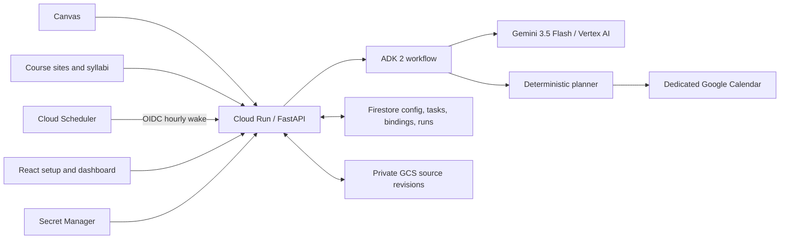
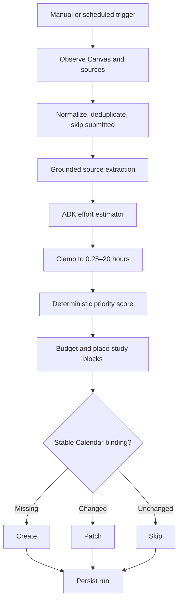

# StudyAgent architecture

## System design

Cloud Run is stateless and may scale to zero. Firestore carries semester state
across wakes. GCS preserves immutable source revisions. Secrets never enter
Firestore or the browser.

## Agent design

Gemini extracts evidenced schedule facts and estimates effort. Dates,
submission filtering, priority, study windows, colors, idempotency, and writes
are deterministic. Writes are restricted to the dedicated calendar.
