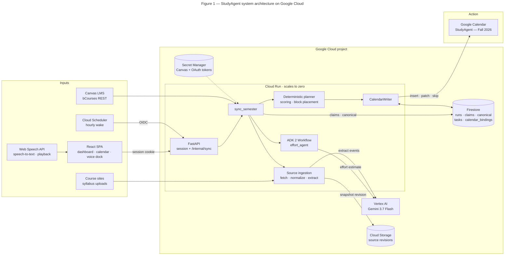
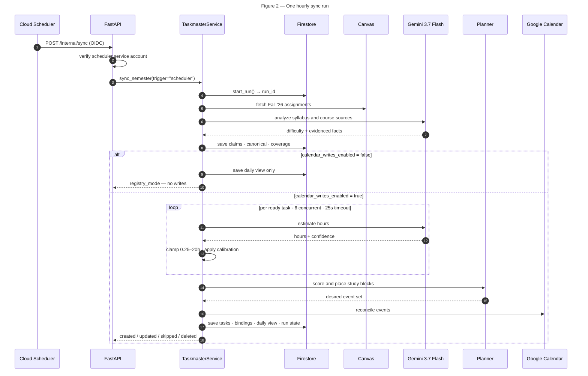
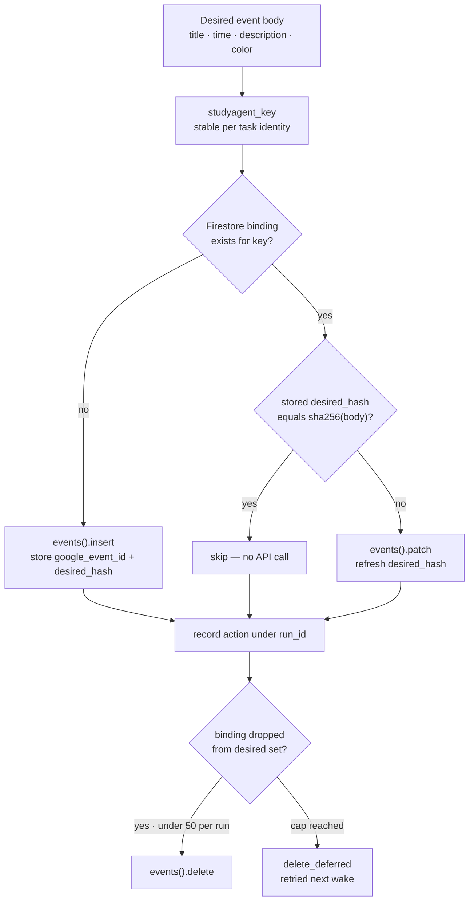

# StudyAgent architecture

StudyAgent is an owner-only academic Taskmaster. Cloud Scheduler wakes it every
hour, it observes Canvas and course sources, reasons about effort with Gemini
through ADK 2, plans deterministically, and reconciles a dedicated Google
Calendar. Firestore carries semester state between wakes so Cloud Run can scale
to zero.

## 1. Deployment and trust boundaries

**Figure 1. StudyAgent system architecture on Google Cloud.** Canvas, course
sources, and an hourly Cloud Scheduler wake all feed one Cloud Run container.
Gemini 3.7 Flash on Vertex AI estimates effort and extracts schedule facts, a
deterministic planner ranks and places the work, and `CalendarWriter` reconciles
a single dedicated Google Calendar. Firestore and Cloud Storage hold all durable
state, so Cloud Run carries none and can scale to zero between wakes.



Secrets stay in Secret Manager and never reach Firestore or the browser. The
Calendar scope is `calendar.app.created`, so writes cannot touch the owner's
personal calendars. Cloud Run is stateless; every durable fact lives in
Firestore or Cloud Storage.

## 2. One sync run

**Figure 2. One hourly sync run, end to end.** Cloud Scheduler wakes the service
over an authenticated endpoint. Gemini is called twice, once to analyze syllabus
and course text and once per task to estimate effort, and both calls are bounded
by timeouts and clamps. Priority, block placement, and the Calendar writes stay
deterministic. When calendar writes are disabled the run stops after persisting
the registry.



Gemini estimates effort and extracts evidenced schedule facts. Dates,
submission filtering, priority, study windows, colors, idempotency, and the
writes themselves are deterministic code, so a bad model response can shift one
estimate without corrupting the schedule.

## 3. Idempotent write decision



Because the key is derived from task identity and the hash from the intended
body, an unchanged rerun performs no Calendar API calls at all and reports
`created: 0, updated: 0`. Deletes are capped at 50 per run so a bad upstream
change cannot cascade into mass removal. Rate-limited calls retry with
exponential backoff behind a 30-second HTTP timeout.

## Rendering diagram images

```bash
pnpm dlx @mermaid-js/mermaid-cli -i docs/architecture.md -o docs/architecture.png -t neutral -b white --scale 3
```

Each block exports as `docs/architecture-1.png` through `docs/architecture-3.png`.
