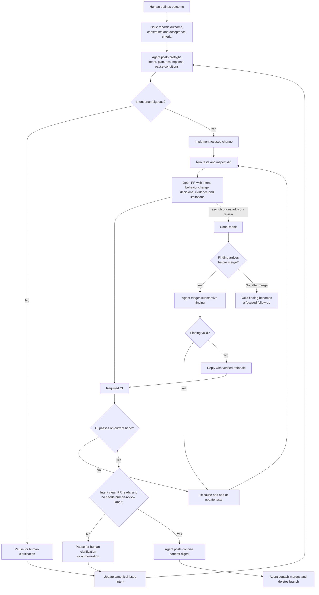

# Agent-merge workflow

Routine, unambiguous changes may be merged by an agent after deterministic CI succeeds on the current commit. CodeRabbit reviews asynchronously and never delays a merge by itself. Humans intervene for ambiguity, intent drift, undisclosed decisions, or unauthorized consequential actions.

## Responsibilities

- **Issue:** Canonical outcome, constraints, non-goals, and acceptance criteria. Material changes agreed in chat must be reflected here.
- **Agent preflight:** Restates intent, the smallest plan, material assumptions, and conditions that would cause a pause.
- **Pull request:** Records the behavior delta, material decisions, verification evidence, CodeRabbit disposition, and limitations.
- **CodeRabbit:** Asynchronously checks the implementation and tests against the issue and PR, then flags drift, omissions, and substantive defects.
- **Human:** Clarifies intent and authorizes consequential actions.

## Merge gates

An agent may squash-merge and delete the branch only when:

1. The requested behavior is covered by the issue and acceptance criteria.
2. No unresolved assumption changes scope or user-visible behavior.
3. Material decisions are disclosed and consequential actions are authorized.
4. `check` succeeds on the current head commit.
5. The PR is not a draft and `needs-human-review` is absent.

CodeRabbit does not control merge eligibility. Findings received before merge are triaged; valid findings received after merge become focused follow-up work.
