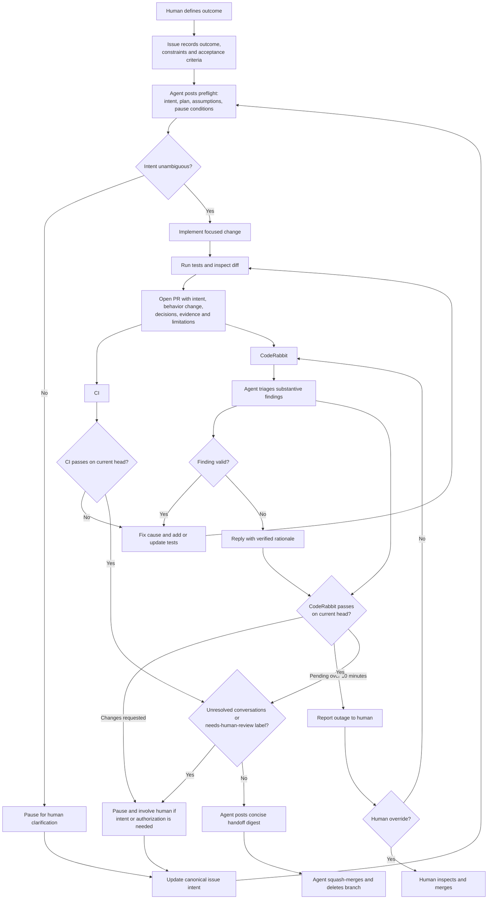

# Agent-merge workflow

Routine, unambiguous changes may be merged by an agent after deterministic CI and CodeRabbit succeed on the current commit. Humans intervene for ambiguity, intent drift, undisclosed decisions, unauthorized consequential actions, or a CodeRabbit outage.

## Responsibilities

- **Issue:** Canonical outcome, constraints, non-goals, and acceptance criteria. Material changes agreed in chat must be reflected here.
- **Agent preflight:** Restates intent, the smallest plan, material assumptions, and conditions that would cause a pause.
- **Pull request:** Records the behavior delta, material decisions, verification evidence, CodeRabbit disposition, and limitations.
- **CodeRabbit:** Checks the implementation and tests against the issue and PR, then flags drift, omissions, and substantive defects.
- **Human:** Clarifies intent, authorizes consequential actions, and decides whether to override a CodeRabbit outage.

## Merge gates

An agent may squash-merge and delete the branch only when:

1. The requested behavior is covered by the issue and acceptance criteria.
2. No unresolved assumption changes scope or user-visible behavior.
3. Material decisions are disclosed and consequential actions are authorized.
4. `check` and `CodeRabbit` succeed on the current head commit.
5. The PR is not a draft, all conversations are resolved, and `needs-human-review` is absent.

If CodeRabbit remains pending for ten minutes, the agent reports the outage and stops. Only a human may explicitly bypass that unavailable check.
